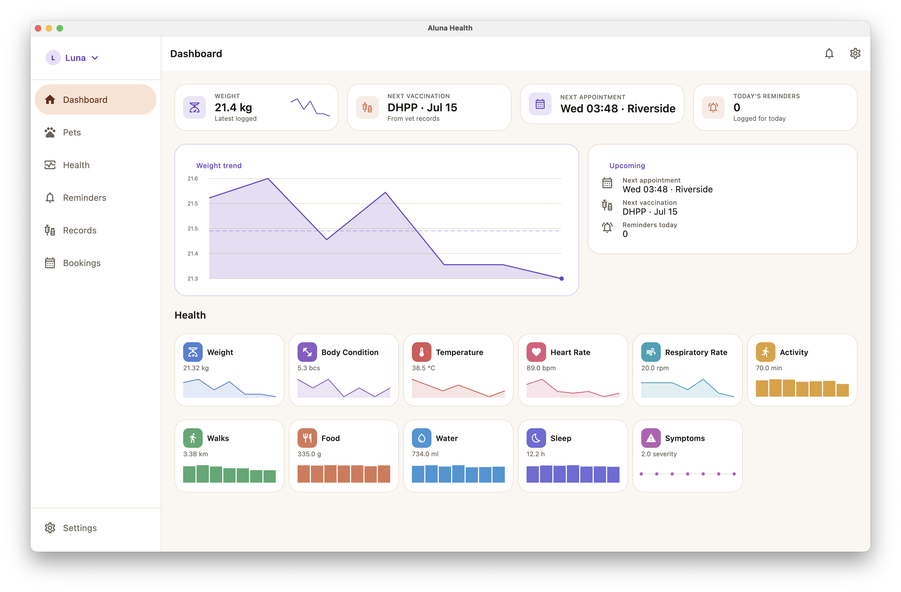
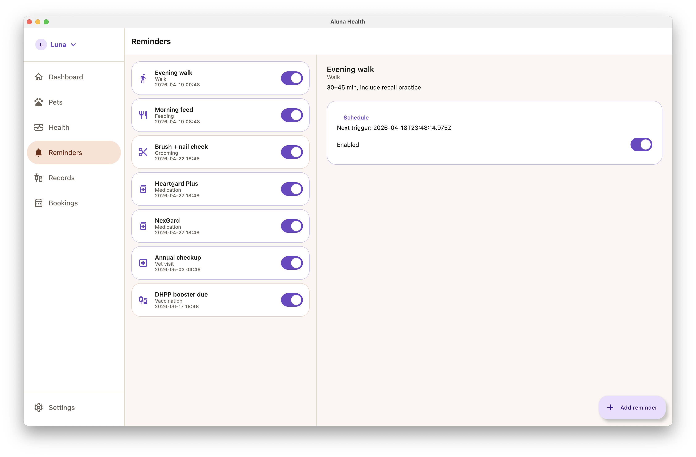
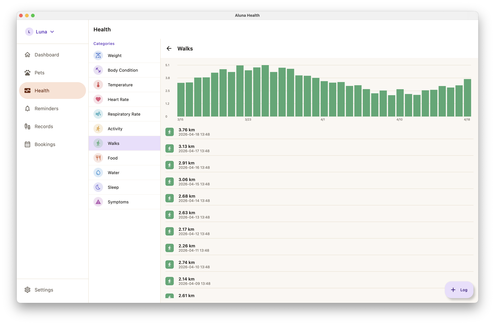
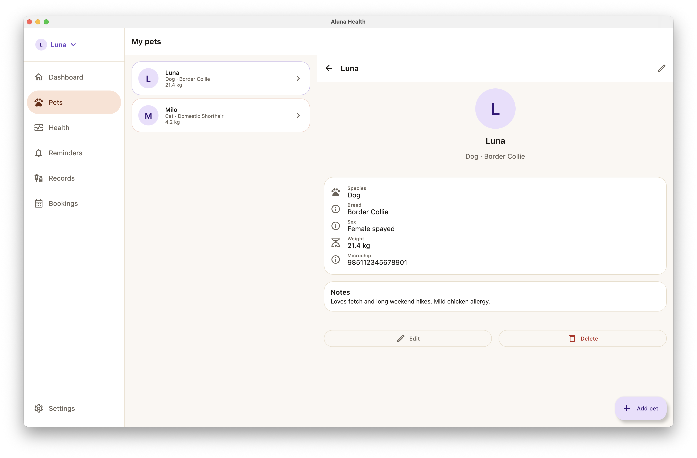

# Aluna Health

 

**A pet health tracker for the whole family.**
*Available on Android, iOS, and Desktop.*

 

---

## About

Aluna Health is a cross-platform pet health tracker that brings the clarity of a modern health app to the animals you care about. Log weight, vitals, nutrition, sleep, walks, and symptoms across multiple pets — then see the trends that matter in one place.

Inspired by the iOS Health app and adapted for pets, Aluna helps owners spot changes early, stay on top of medications and vaccinations, and share clean medical summaries with their vet.

## Features

- **Multi-pet profiles** — photo, species, breed, weight, microchip ID, allergies, and notes, with a quick pet-switcher in the top bar.
- **Dashboard at a glance** — latest weight, next vaccination, next appointment, and today's reminders on one screen.
- **Health categories** — weight, body condition, temperature, heart rate, respiratory rate, activity, walks, food, water, sleep, and symptoms. Each with logging and trend charts.
- **Medications & vaccinations** — schedule doses, track refills, and keep a full vaccination history.
- **Reminders** — feeding, walking, medication, grooming, and vet visits, delivered via local notifications.
- **Vet booking** — find nearby clinics on a map and book available slots directly from the app.
- **Medical history export** — generate a PDF summary to share with your vet in one tap.

## Platforms

| Platform | Status |
|---|---|
| Android | Available |
| iOS | Available |
| Desktop (macOS / Windows / Linux) | Available |

## Download

Head over to the [Releases](../../releases) page to grab the latest build for your platform.

## Screenshots

## License

See [LICENSE](LICENSE) for details.
